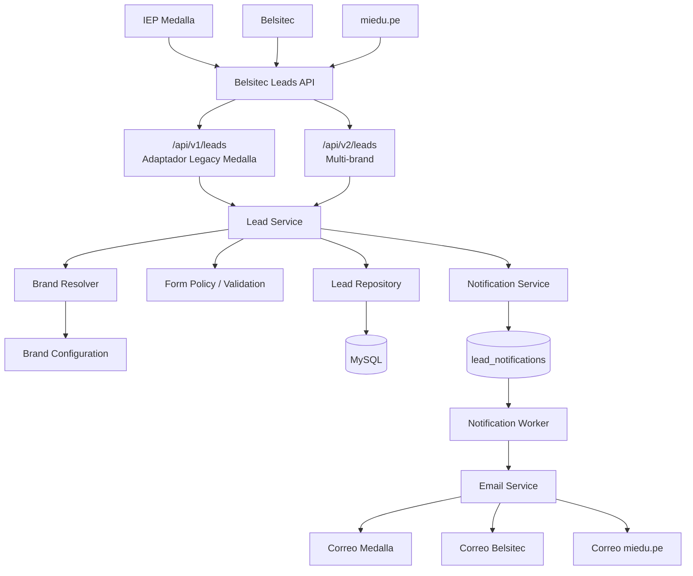
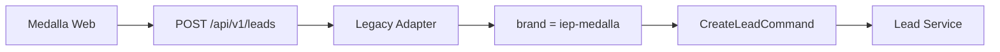
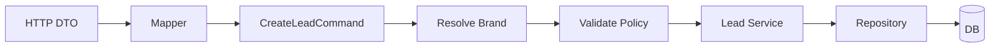
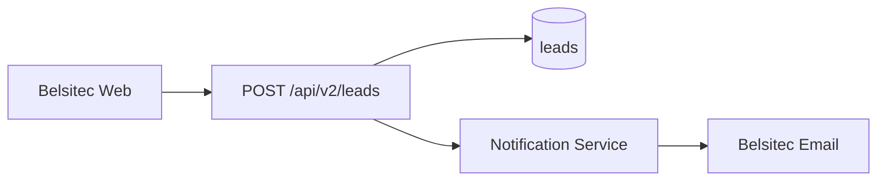
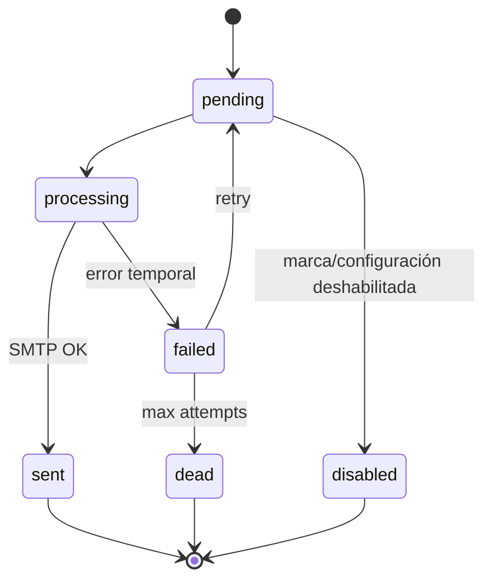

# Plan de Migración y Homologación
## IEP Medalla Leads API → Belsitec Leads API

> Estado actualizado el 2026-09-11: las revisiones descritas en esta sección están implementadas. Las secciones posteriores conservan el contexto de diseño original; ante diferencias, prevalecen las revisiones Alembic y esta sección operativa.

## Revisiones implementadas

| Revisión | Cambio | Downgrade |
| --- | --- | --- |
| `20260811_01` | Esquema histórico `leads` | Elimina tabla; no editar |
| `20260911_01` | Expande leads, amplía `form_type`, backfill Medalla e índices multi-brand | Elimina campos nuevos; solo seguro sin datos multi-brand |
| `20260911_02` | Crea y rellena `lead_notifications` desde estados legacy | Elimina jobs; no revierte correos enviados |
| `20260911_03` | Crea `consumer_complaints` separado | Elimina reclamos; destructivo |

La revisión `20260911_01` asume que las filas anteriores pertenecen a Medalla porque el único writer versionado era v1 Medalla. Antes de producción, comprobar por recuentos, URLs de origen y responsables que esto es cierto. Si no lo es, detener el backfill y preparar una revisión correctiva.

## Procedimiento de despliegue expand/activate

1. Tomar backup y probar restauración; registrar `alembic current`, versión/tamaño de MySQL y recuentos por `form_type`/origen.
2. Ensayar `alembic upgrade head` sobre una copia. Comprobar backfill, columnas, índices y dos jobs por lead sin reenvío de estados `sent`.
3. Desplegar código compatible manteniendo `api.iepmedalla.com` y v1.
4. Ejecutar `APP_ENV=production .venv/bin/alembic upgrade head`.
5. Reiniciar API y probar health más un lead v1 controlado.
6. Instalar y habilitar `belsitec-leads-notification-worker.timer`; asegurar que no quede otro cron de `retry_emails` en paralelo.
7. Configurar orígenes, remitentes y destinatarios reales en el registry; probar SMTP sandbox. Activar Belsitec y luego miedu de forma gradual.
8. Observar backlog `pending/failed/dead`, errores por marca, latencia y posibles duplicados.

Comandos:

```bash
APP_ENV=production .venv/bin/alembic current
APP_ENV=production .venv/bin/alembic upgrade head
sudo cp deploy/systemd/belsitec-leads-notification-worker.service /etc/systemd/system/
sudo cp deploy/systemd/belsitec-leads-notification-worker.timer /etc/systemd/system/
sudo systemctl daemon-reload
sudo systemctl enable --now belsitec-leads-notification-worker.timer
```

## Rollback operativo

No ejecutar `alembic downgrade` sobre datos captados sin exportación/revisión: los downgrades 01 y 03 eliminan información. Para rollback seguro, desactivar tráfico v2 en proxy/configuración, mantener tablas/columnas, y desplegar la última versión de aplicación que entienda `brand_key` y la cola durable. No reactivar el sender legacy una vez existan leads de varias marcas porque podría usar identidad Medalla.

Si la migración falla antes de activar nuevas marcas, restaurar el backup o corregir hacia adelante según el punto exacto; validar recuentos antes de reiniciar writers. Un correo aceptado por SMTP no puede deshacerse.

## 1. Objetivo

Evolucionar el servicio actual `iep-medalla-leads-api`, desarrollado inicialmente para IEP Medalla, hacia una API centralizada de captura y gestión de leads que pueda ser utilizada por:

- IEP Medalla
- Belsitec
- miedu.pe

El objetivo NO es crear un backend independiente para cada marca.

Se busca mantener un único servicio backend capaz de:

1. identificar la marca que genera el lead;
2. identificar el formulario que lo genera;
3. aplicar validaciones específicas por formulario;
4. almacenar información común y específica;
5. conservar trazabilidad del origen;
6. gestionar notificaciones por marca;
7. soportar nuevos formularios y marcas en el futuro;
8. mantener compatibilidad con la integración actual de Medalla.

La homologación debe realizarse mediante una evolución controlada del proyecto existente.

No se debe reescribir el backend desde cero.

---

# 2. Principios técnicos

La implementación deberá seguir los siguientes criterios:

- Clean Code.
- separación de responsabilidades;
- arquitectura modular;
- bajo acoplamiento;
- alta cohesión;
- backward compatibility;
- configuración desacoplada por marca;
- validaciones estrictas;
- seguridad por defecto;
- migraciones incrementales;
- observabilidad;
- testing automatizado;
- evitar lógica hardcodeada;
- evitar duplicación;
- evitar DTOs gigantes;
- evitar microservicios innecesarios;
- evitar overengineering.

Se mantendrá inicialmente una arquitectura de monolito modular con FastAPI.

---

# 3. Estado actual

Actualmente el servicio fue construido específicamente para Medalla.

Flujo principal:

```mermaid
flowchart TD
    A[Web IEP Medalla] --> B[POST /api/v1/leads]

    B --> C[FastAPI<br/>IEP Medalla Leads API]

    C --> D[Validación Pydantic]
    D --> E[Repository]
    E --> F[(MySQL<br/>leads)]

    E --> G[BackgroundTasks]

    G --> H[Correo administrativo]
    G --> I[Correo al usuario]
```



El modelo actual de `leads` contiene campos orientados específicamente a Medalla:

```text
form_type
full_name
phone
email

education_level
grade
contact_reason
message

status
notes

privacy_accepted
privacy_accepted_at
privacy_policy_version

marketing_consent
marketing_consent_at

source_url
utm_source
utm_medium
utm_campaign

admin_email_status
user_email_status
admin_email_sent_at
user_email_sent_at
email_error

created_at
updated_at
```

El principal problema es que:

```text
education_level
grade
contact_reason
```

son conceptos específicos de determinados formularios de Medalla y no representan adecuadamente los formularios de Belsitec o miedu.pe.

---

# 4. Arquitectura objetivo

El backend pasará a funcionar como:



---

# 5. Dominio homologado

Se diferenciarán tres conceptos.

## 5.1 Brand

Identifica a quién pertenece el lead.

Valores iniciales:

```text
iep-medalla
belsitec
miedu-pe
```

Campo:

```text
brand_key
```

---

## 5.2 Form Type

Identifica el tipo de formulario.

Ejemplos:

### Medalla

```text
admission
contact
```

### Belsitec

```text
meeting_request
```

### miedu.pe

```text
demo_request
sales_contact
```

---

## 5.3 Source Key

Identifica desde qué CTA, sección o punto de captación fue abierto el formulario.

Ejemplos:

```text
admission_page
contact_page
hero_demo
admission_2027
pricing
promotion
contact_section
footer_demo
```

Ejemplo:

```text
brand       = miedu-pe
form_type   = demo_request
source_key  = admission_2027
```

Significa:

> Lead de miedu.pe generado mediante el formulario de demo, originado desde el CTA de Admisión 2027.

---

# 6. Estrategia de persistencia

No se crearán decenas de columnas particulares para cada marca.

Se utilizará un modelo híbrido:

```text
Lead
│
├── información común
│
└── form_data
        └── información específica del formulario
```

---

# 7. Modelo objetivo de `leads`

La tabla evolucionará aproximadamente hacia:

```text
leads

id

brand_key
form_type
source_key

full_name
email
phone
phone_country

organization_name
job_title
message

form_data JSON

status
classification
assigned_to
next_follow_up_at
notes

privacy_accepted
privacy_accepted_at
privacy_policy_version

marketing_consent
marketing_consent_at

source_url

utm_source
utm_medium
utm_campaign
utm_content
utm_term

device_type

created_at
updated_at
```

---

# 8. Datos específicos mediante `form_data`

## Medalla - Admission

```json
{
  "educationLevel": "Inicial",
  "grade": "4 años"
}
```

---

## Medalla - Contact

```json
{
  "contactReason": "Información académica"
}
```

El mensaje puede permanecer como campo común `message`.

---

## Belsitec

```json
{
  "contactDescription": "Deseo conocer las soluciones educativas."
}
```

La clasificación, comercial y próximo seguimiento NO serán enviados por el frontend.

Serán calculados por backend.

---

## miedu.pe - Demo

```json
{
  "studentRange": "201–500",
  "primaryNeed": "Admisión"
}
```

---

## miedu.pe - Sales Contact

```json
{
  "studentRange": "201–500",
  "primaryNeed": "Comunicación con familias",
  "city": "Lima",
  "preferredContactSchedule": "Mañana (9am – 12pm)"
}
```

---

# 9. API v1

Se mantendrá:

```http
POST /api/v1/leads
```

Este endpoint seguirá siendo compatible con el frontend actual de Medalla.

El frontend NO tendrá que agregar:

```json
{
  "brand": "iep-medalla"
}
```

El adapter de v1 establecerá internamente:

```text
brand_key = iep-medalla
```

Flujo:



---

# 10. API v2

Se incorporará:

```http
POST /api/v2/leads
```

Esta será la interfaz homologada.

Ejemplo:

```json
{
  "brand": "miedu-pe",
  "formType": "demo_request",
  "sourceKey": "hero_demo",

  "fullName": "María García",
  "email": "direccion@ejemplo.pe",

  "phoneCountry": "PE",
  "phone": "999999999",

  "organizationName": "Colegio Ejemplo",
  "jobTitle": "Directora",

  "privacyAccepted": true,

  "sourceUrl": "/",

  "utmSource": "google",
  "utmMedium": "cpc",
  "utmCampaign": "demo",

  "data": {
    "studentRange": "201–500",
    "primaryNeed": "Admisión"
  }
}
```

---

# 11. Validación por formulario

No se implementará un único schema con todos los campos opcionales.

Se implementarán contratos específicos.

Conceptualmente:

```text
LeadCreateV2
│
├── MedallaAdmissionLead
├── MedallaContactLead
├── BelsitecMeetingLead
├── MieduDemoLead
└── MieduSalesContactLead
```

La validación se resolverá mediante:

```text
brand + formType
```

Ejemplo:

```text
iep-medalla + admission
```

requiere:

```text
fullName
phone
email
privacyAccepted
educationLevel
grade
```

Mientras:

```text
miedu-pe + demo_request
```

requiere:

```text
fullName
phoneCountry
phone
organizationName
studentRange
privacyAccepted
```

---

# 12. Configuración por marca

Crear:

```text
config/brands.json
```

Ejemplo conceptual:

```json
{
  "iep-medalla": {
    "displayName": "IEP Medalla",
    "enabled": true,
    "allowedForms": [
      "admission",
      "contact"
    ]
  },

  "belsitec": {
    "displayName": "Belsitec",
    "enabled": true,
    "allowedForms": [
      "meeting_request"
    ],
    "defaultAssignee": "Fidel Limaylla"
  },

  "miedu-pe": {
    "displayName": "miedu.pe",
    "enabled": true,
    "allowedForms": [
      "demo_request",
      "sales_contact"
    ]
  }
}
```

Los destinatarios, perfiles SMTP y configuraciones de seguridad deben ser administrados por backend.

El frontend nunca podrá enviar:

```text
recipient
from_address
smtp_password
template
assigned_to
classification
next_follow_up_at
```

---

# 13. Estructura objetivo del proyecto

Codex deberá analizar primero la estructura real antes de realizar movimientos.

Como referencia, el resultado deberá tender hacia:

```text
app/
│
├── main.py
│
├── config.py
├── brands.py
│
├── routers/
│   ├── leads.py
│   ├── leads_v2.py
│   └── complaints.py
│
├── schemas/
│   ├── lead.py
│   ├── lead_v2.py
│   ├── medalla.py
│   ├── belsitec.py
│   ├── miedu.py
│   └── complaint.py
│
├── models/
│   ├── lead.py
│   ├── notification.py
│   └── complaint.py
│
├── services/
│   ├── leads.py
│   ├── email.py
│   ├── notifications.py
│   ├── classifications.py
│   └── complaints.py
│
├── repositories/
│   ├── leads.py
│   ├── notifications.py
│   └── complaints.py
│
├── templates/
│   └── email/
│
└── middleware/
    ├── request_id.py
    ├── body_limit.py
    └── security.py

config/
└── brands.json

alembic/

tests/

docs/
```

Esto es una referencia arquitectónica, no una instrucción para mover archivos innecesariamente.

Codex debe reutilizar la estructura actual siempre que tenga sentido.

---

# 14. Plan de migración

## Fase 0 - Baseline

- [ ] Ejecutar todos los tests actuales.
- [ ] Registrar cobertura.
- [ ] Registrar estructura actual.
- [ ] Documentar endpoints.
- [ ] Documentar modelos.
- [ ] Documentar schemas.
- [ ] Documentar flujo de correo.
- [ ] Documentar configuración.
- [ ] Identificar dependencias.
- [ ] Identificar deuda técnica.
- [ ] Identificar acoplamiento Medalla.

No modificar comportamiento todavía.

---

## Fase 1 - Proteger Medalla

- [ ] Crear tests de regresión de `/api/v1/leads`.
- [ ] Cubrir `admission`.
- [ ] Cubrir `contact`.
- [ ] Cubrir errores 422.
- [ ] Cubrir honeypot.
- [ ] Cubrir normalización.
- [ ] Cubrir UTM.
- [ ] Cubrir persistencia.
- [ ] Cubrir fallo SMTP.

Objetivo:

> Tener evidencia automática de que la homologación no rompe Medalla.

---

## Fase 2 - Refactor interno

- [ ] Mover lógica de negocio fuera del router.
- [ ] Crear/adecuar `LeadService`.
- [ ] Separar acceso a datos mediante repository.
- [ ] Separar composición de correo.
- [ ] Separar transporte SMTP.
- [ ] Centralizar configuración.
- [ ] Centralizar manejo de errores.
- [ ] Eliminar lógica duplicada.
- [ ] Mantener comportamiento funcional existente.

Aplicar:

- Clean Code.
- SRP.
- Dependency inversion donde aporte valor.
- bajo acoplamiento.
- alta cohesión.

No crear interfaces o abstracciones innecesarias.

---

## Fase 3 - Migración de base de datos

Crear una nueva revisión Alembic.

Agregar:

- [ ] `brand_key`
- [ ] `source_key`
- [ ] `phone_country`
- [ ] `organization_name`
- [ ] `job_title`
- [ ] `form_data`
- [ ] `classification`
- [ ] `assigned_to`
- [ ] `next_follow_up_at`
- [ ] `device_type`
- [ ] `utm_content`
- [ ] `utm_term`

Modificar:

- [ ] `form_type ENUM` → `VARCHAR`

No borrar:

- [ ] `education_level`
- [ ] `grade`
- [ ] `contact_reason`
- [ ] estados actuales de correo

todavía.

---

## Fase 4 - Backfill Medalla

Antes de ejecutar el backfill:

- [ ] verificar que los registros existentes sean de Medalla;
- [ ] realizar backup;
- [ ] comprobar versión Alembic;
- [ ] comprobar conteos.

Posteriormente:

```text
brand_key = iep-medalla
```

para los registros existentes.

---

## Fase 5 - Brand Registry

- [ ] Crear `config/brands.json`.
- [ ] Crear modelo Pydantic de configuración.
- [ ] Validar configuración durante startup.
- [ ] Rechazar marcas duplicadas.
- [ ] Rechazar formularios desconocidos.
- [ ] Rechazar emails inválidos.
- [ ] Rechazar templates inexistentes.
- [ ] Rechazar configuraciones incompletas.
- [ ] No implementar fallback entre marcas.

---

## Fase 6 - Servicio interno homologado

Crear un comando interno independiente de HTTP.

Por ejemplo:

```text
CreateLeadCommand
```

El flujo interno debe ser:



Tanto v1 como v2 deben terminar utilizando este flujo.

---

## Fase 7 - Adapter Medalla v1

- [ ] Mantener `/api/v1/leads`.
- [ ] Mantener schema actual.
- [ ] Mantener respuestas actuales.
- [ ] Asignar internamente `iep-medalla`.
- [ ] Mapear información Medalla al modelo interno.
- [ ] Poblar `form_data`.
- [ ] Mantener columnas legacy durante transición.

---

## Fase 8 - API v2

Implementar:

```http
POST /api/v2/leads
```

- [ ] `brand` obligatorio.
- [ ] `formType` obligatorio.
- [ ] validación discriminada.
- [ ] rechazo de campos desconocidos.
- [ ] normalización.
- [ ] validación de brand.
- [ ] validación de formulario permitido.
- [ ] validación de origin.
- [ ] errores normalizados.
- [ ] `X-Request-ID`.

---

## Fase 9 - Integración Belsitec

Eliminar dependencia de:

```text
FormSubmit
```

Flujo nuevo:



Frontend:

- [ ] `brand = belsitec`
- [ ] `formType = meeting_request`
- [ ] mapear nombre.
- [ ] mapear cargo.
- [ ] mapear institución.
- [ ] mapear teléfono.
- [ ] mapear mensaje.
- [ ] enviar UTM.
- [ ] enviar source.

Backend:

- [ ] calcular clasificación.
- [ ] asignar comercial.
- [ ] calcular próximo seguimiento.
- [ ] generar fecha.
- [ ] determinar destinatarios.
- [ ] determinar template.
- [ ] determinar asunto.

---

## Fase 10 - Integración miedu.pe

Eliminar la simulación actual.

Implementar:

```text
demo_request
sales_contact
```

- [ ] Enviar a `/api/v2/leads`.
- [ ] agregar `brand = miedu-pe`.
- [ ] normalizar país y teléfono.
- [ ] persistir colegio.
- [ ] persistir cantidad de estudiantes.
- [ ] persistir cargo.
- [ ] persistir necesidad.
- [ ] persistir ciudad.
- [ ] persistir horario.
- [ ] implementar `sourceKey`.

Ejemplos:

```text
hero_demo
admission_2027
pricing
promotion
contact_section
footer_demo
```

---

# 15. Libro de Reclamaciones

El Libro de Reclamaciones de miedu.pe NO se almacenará como Lead.

Crear dominio independiente.

Endpoint:

```http
POST /api/v1/complaints
```

Tabla:

```text
consumer_complaints
```

Información:

```text
id
brand_key
full_name
document
email
phone
address
representative
service
amount
complaint_type
detail
requested_solution
status
source_url
created_at
updated_at
```

Razón:

Un reclamo es una entidad funcional y legal distinta a una oportunidad comercial.

---

# 16. Notificaciones

Crear:

```text
lead_notifications
```

Modelo aproximado:

```text
id
lead_id
kind
status
attempt_count
next_attempt_at
locked_until
claim_token
sent_at
last_error_code
created_at
updated_at
```

Estados:

```text
pending
processing
sent
failed
disabled
dead
```

La creación deberá realizarse junto al lead dentro de la misma operación transaccional cuando corresponda.

---

# 17. Procesador de notificaciones

No introducir Redis o Celery en esta etapa salvo que exista una justificación técnica concreta.

Implementar inicialmente un worker/command periódico.

Flujo:



---

# 18. Seguridad

Antes de abrir Belsitec y miedu en producción:

- [ ] TLS MySQL obligatorio.
- [ ] Validación de certificado.
- [ ] TLS SMTP obligatorio.
- [ ] CORS controlado.
- [ ] Allowed origins por marca.
- [ ] Validación de Origin.
- [ ] Rate limit global.
- [ ] Rate limit marca/IP.
- [ ] Payload máximo.
- [ ] Honeypot.
- [ ] Rechazo de campos desconocidos.
- [ ] Sanitización adecuada.
- [ ] No guardar PII en logs.
- [ ] No guardar payload completo en errores.
- [ ] No guardar credenciales en código.
- [ ] Request ID.
- [ ] Logs estructurados.
- [ ] SQLAlchemy con parámetros sensibles ocultos.

---

# 19. Logging y observabilidad

Cada request debería poder registrar:

```text
event
request_id
lead_id
brand
form_type
source_key
http_status
duration_ms
```

Para correos:

```text
notification_kind
attempt
status
error_code
```

NO registrar:

```text
full_name
email
phone
message
document
address
SMTP password
DATABASE_URL
request body
```

---

# 20. Testing

## Unit

- [ ] Brand resolver.
- [ ] Form policies.
- [ ] Normalizers.
- [ ] Classification.
- [ ] Email composition.
- [ ] Mappers.
- [ ] Lead service.

## Contract

- [ ] Medalla admission v1.
- [ ] Medalla contact v1.
- [ ] Medalla admission v2.
- [ ] Belsitec meeting request.
- [ ] miedu demo.
- [ ] miedu sales contact.

## Error cases

- [ ] Marca desconocida.
- [ ] Marca deshabilitada.
- [ ] Formulario desconocido.
- [ ] Formulario no habilitado.
- [ ] Campo requerido ausente.
- [ ] Campo desconocido.
- [ ] Origin incorrecto.
- [ ] Consentimiento incorrecto.
- [ ] Rate limit.
- [ ] Payload demasiado grande.

## Persistence

- [ ] Alembic desde DB vacía.
- [ ] Alembic desde esquema actual.
- [ ] Backfill.
- [ ] Rollback lógico.
- [ ] Conservación de IDs.

## Notification

- [ ] SMTP OK.
- [ ] SMTP temporalmente caído.
- [ ] max retries.
- [ ] worker reiniciado.
- [ ] dos workers concurrentes.
- [ ] marca incorrecta nunca recibe correo.

---

# 21. Orden de liberación

```mermaid
flowchart LR

    A[Baseline]
    --> B[Regression Tests]

    B --> C[Internal Refactor]

    C --> D[DB Migration]

    D --> E[Brand Registry]

    E --> F[Shared Lead Service]

    F --> G[v1 Adapter]

    G --> H[v2 API]

    H --> I[Notification System]

    I --> J[Belsitec Testing]

    J --> K[miedu Testing]

    K --> L[Belsitec Production]

    L --> M[miedu Production]

    M --> N[Legacy Cleanup]
```



---

# 22. Estrategia de rollback

Mientras solo Medalla esté activa:

- permitir volver temporalmente a la aplicación anterior;
- mantener default/backfill compatible durante la transición.

Después de comenzar a almacenar leads Belsitec o miedu:

- NO ejecutar código antiguo que desconozca `brand_key`;
- NO eliminar columnas nuevas;
- NO ejecutar downgrade destructivo;
- deshabilitar captación v2 si ocurre un incidente;
- conservar datos recibidos;
- mantener activo únicamente un procesador de correo compatible multi-marca.

---

# 23. Criterios de aceptación

La homologación se considera terminada cuando:

- [ ] Medalla continúa funcionando sin cambios de frontend.
- [ ] Belsitec ya no utiliza FormSubmit.
- [ ] miedu deja de simular solicitudes.
- [ ] Todos los leads identifican su marca.
- [ ] Todos los leads identifican su formulario.
- [ ] Se registra `sourceKey` cuando corresponde.
- [ ] Cada formulario tiene validaciones propias.
- [ ] Cada marca utiliza su configuración de correo.
- [ ] Ningún frontend controla destinatarios.
- [ ] Los correos fallidos pueden recuperarse.
- [ ] No se pierden leads por fallo SMTP.
- [ ] Existe trazabilidad mediante request ID.
- [ ] Los logs no contienen PII.
- [ ] Las migraciones están automatizadas.
- [ ] La suite v1 continúa pasando.
- [ ] Las suites v2 pasan.
- [ ] Se documenta OpenAPI.
- [ ] Se documenta cómo agregar una nueva marca.
- [ ] Se documenta cómo agregar un nuevo formulario.

---

# 24. Resultado final

La solución final debe permitir incorporar algo como:

```text
kuvel
```

sin crear:

```text
kuvel-leads-api
```

Si utiliza un formulario existente, el alta debería consistir principalmente en:

```text
1. configurar la marca;
2. configurar origen;
3. configurar correo;
4. habilitar formularios;
5. agregar tests;
```

Si requiere un nuevo tipo de formulario:

```text
1. agregar schema;
2. agregar policy;
3. agregar mapper;
4. agregar template si corresponde;
5. agregar tests.
```

La arquitectura debe crecer por configuración y módulos pequeños, no por duplicación del backend.
